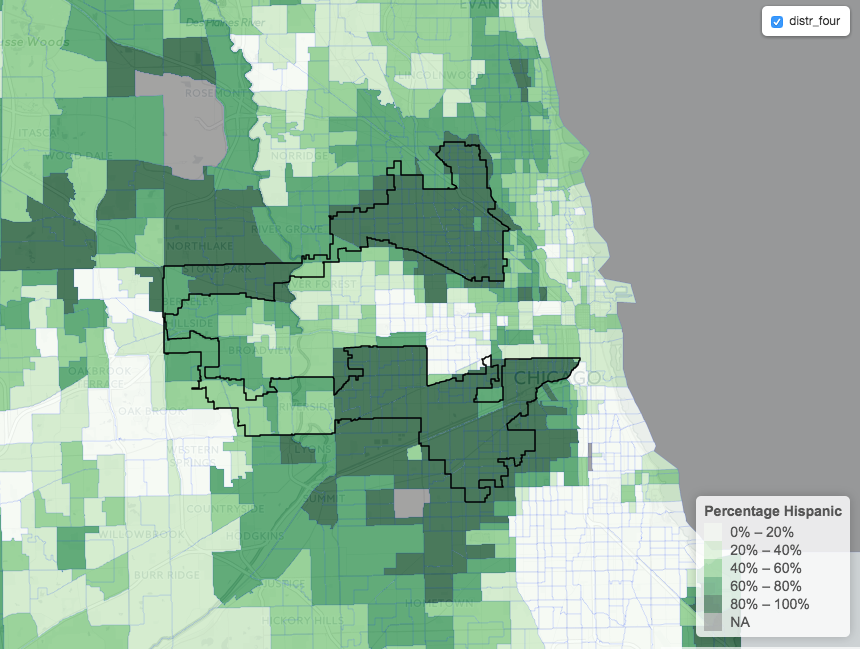

# Gerrymandering: making maps with R and Leaflet

I'll use `R` and `Leaflet` to present a particularly nasty example of gerrymandering: [our beloved District Four in Illinois](https://en.wikipedia.org/wiki/Illinois's_4th_congressional_district).

According to Wikipedia, "it was created to pack two majority Hispanic parts of Chicago into one district", so let's use the Census data to check how the district follows the ethnic borders.


To produce a map, we need to prepare a geo dataset following these steps


1. Get the census tract polygons
2. Get the Census Data
3. Merge census data with the polygons
4. Get the polygons for District Four
5. Use `leaflet` for R to plot
6. (optional) Export to `.geojson` for Leaflet

### Get the census tract polygons

Thanks to the `tigris` package, this is incredibly straightforward:

```r
library(sp)
library(tigris)
# Counties that overlap with district 4
county_list = c("Cook", "DuPage", "Will County")
ill_tracts <- tracts(state = 'IL', 
                     county = county_list)
```

By default, these polygons will be from 2015.

### Get the Census Data

I'll use the percentage of hispanics in a Census tract, so we need, by tract, a measure of the total population and of the hispanic population.

 `R` has a very convenient package called `acs` to download specific variables from different geographies. In this case I will download all tracts from out `county_list`
 
You will need to get your API key from the Census, but it takes 40 seconds to do it!

```r
library(acs)
# This only need to be done once!
api.key.install("your_key_here")

pop_hisp = acs.fetch(geo=geo.make(state="IL",
                county=county_list, tract="*"),
                endyear = 2010, dataset="sf1",
                variable=c("P0010001", "P0040003"))
```

`sf1` and `endyear=2010` means we are downloading the Census data for 2010. `P0010001` contains the total population in a census tract, while `P0040003` has hispanic population in that tract.

`pop_hisp` is an `acs` package object, which contains the estimates for our variables, plus the name of the State, County and Census tract (under `geography`). 

[Click here for the definition of all variables of the short form of the Census](http://api.census.gov/data/2010/sf1/variables.html)

### Merge Census data with the polygons

We need to prepare `pop_hisp` a bit for the merge

```r
col1 = pop_hisp@geography$NAME
col2 = (pop_hisp@estimate[,"P0040003"] 
           / pop_hisp@estimate[,"P0010001"])
hispanic_df <- data.frame(col1, col2)
colnames(hispanic_df) <- c("NAMELSAD", "perc_hispanic")
```

`hispanic_df` is a `data.frame` with a percentage hispanic column and a `NAMELSAD` column that contains the Census Tract number. We'll use this one as a key to make the merge with the polygons contains in `ill_tracts`

 
```r
hispanic_merged = geo_join(ill_tracts, hispanic_df,
                           "NAMELSAD", "NAMELSAD")
```

`hispanic_merge` is a `SpatialPolygonsDataFrame` that is pretty much a `data.frame` augmented with a geometry of polygons. I haven't used this package much, but the idea seems very similar to `geopandas`, which has extended dataframes from `pandas` to include geometry. 

### Get the polygons for District Four

Once again, `tigris` comes to the rescue

```r
cds = congressional_districts()

#Keep District Four from Illinois
ill_code = "17"
distr_four = cds[(cds@data$STATEFP == ill_code) 
                 & (cds@data$NAMELSAD =="Congressional District 4") , ]

```


## Leaflet Time

If you haven't heard of it, `Leaflet` is a javascript library that makes it easy to produce stunning interactive maps.

`R` has a library conveniently called `leaflet` to interact with the javascript library without leaving `RStudio`. This doesn't expose all of `Leaflet`, but from the little I've seen it provides a lot of the functionality.

Let's make a choropleth plot with the `leaflet` R package to see if we're on the right track

```r
library(leaflet)

pal <- colorQuantile("Greens", NULL, n=5)

popup <- paste0("<span style='color:#7f0000'><strong>
                Percentage Hispanic: </strong></span>", 
                as.character(round(hispanic_merged$perc_hispanic,
                                   digit=3)))

leaflet() %>%
    addProviderTiles("CartoDB.Positron") %>%
    addPolygons(data = hispanic_merged, 
                fillColor = ~pal(hispanic_merged$perc_hispanic), 
                fillOpacity = 0.7, 
                weight = 0.2, 
                smoothFactor = 0.2, 
                popup = popup) %>%
    addPolygons(data = distr_four, 
                fillOpacity = 0.,
                stroke=TRUE, opacity=1,
                weight = 1.5, color="black",
                smoothFactor = 0.5, group="distr_four") %>%
    addLegend(pal = pal, 
              values = hispanic_merged$perc_hispanic, 
              position = "bottomright", 
              title = "Percentage Hispanic") %>%
    addLayersControl(
        overlayGroups = c("distr_four"),
        options = layersControlOptions(collapsed = FALSE)
    )
```




[Click here for the interactive map](../assets/article_images/gerrymandering_map.html)


### Export everything to GeoJson

You might want to work directly with the `Leaflet` javascript library, since it provides with more options and possibilities.

`Leaflet` read `.geojson` files, so we need to export the `SpatialPolygonsDataFrame` to `.geojson`.

This is pretty straightforward, but I ran into some issues with `writeOGR` complaining the file already existed, so I had to add a `if exists: delete` line.

```r
library("rgdal")

# Export hispanic_merged
geojson_file = "hispanic_merged.geojson"
if (file.exists(geojson_file)) file.remove(geojson_file)

writeOGR(hispanic_merged, geojson_file,
        "hispanic_merged", driver="GeoJSON",
        check_exists=FALSE, overwrite_layer=TRUE)
        
# Export district four
distr_four_file = "distr_four.geojson"
if (file.exists(district_four_file)) file.remove(district_four_file)

writeOGR(dist_four, distr_four_file,
        "distr_four", driver="GeoJSON",
        check_exists=FALSE, overwrite_layer=TRUE)
```

